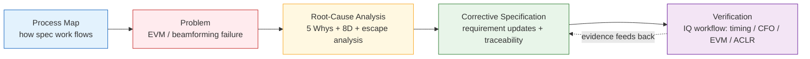
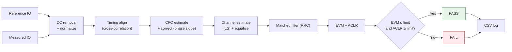

# 5G RF Architecture, Specification & Verification

A complete, specification-driven engineering case study of a **5G RF beamforming /
EVM verification failure**-traced from a measured performance issue to its root
cause using structured problem-solving (process mapping, 5 Whys, 8D, RCA), closed
with corrective specification updates and requirement traceability, and backed by
a working IQ-signal verification workflow in **MATLAB, Python, and C**.


> **In 2 minutes:** a 5G beamforming EVM failure is traced-via 5 Whys and a full
> 8D-to a *specification cross-dependency gap*, not a one-off bug. It's then
> closed with corrective requirement updates, a traceability matrix, and a working
> IQ verification workflow (timing / CFO / channel correction → EVM / ACLR) that
> runs in MATLAB, Python, and C. Start with
> [`02-problem-statement`](./02-problem-statement/evm-failure-problem-statement.md),
> then [`03-root-cause-analysis`](./03-root-cause-analysis/).

---

## What this repository demonstrates

- **Process mapping** — 5G RF specification workflow, feature → release
- **5 Whys** — root-cause analysis of the EVM degradation
- **8D** — full eight-discipline problem-solving report
- **Root cause analysis** — technical / specification / process layers + test-escape
- **Requirement traceability** — requirement → method → test → evidence
- **RF architecture workflow** — TX/RX chain, antenna path, beamforming, calibration
- **BF/BFC, timing, carrier configuration issue analysis** — the cross-dependency failure
- **Corrective / preventive action planning** — CAPA + impairment budgeting
- **Six Sigma Yellow Belt application** — methodology applied to a real RF problem

It follows a single scenario through the **complete engineering loop** a system
specification engineer owns:



The scenario: under a specific carrier configuration and timing condition,
beamforming calibration (BFC) did not fully compensate antenna/RF-path gain and
phase errors, degrading beam-level EVM. The investigation shows the failure was
not a one-off implementation bug but a **specification-coverage gap** in the
cross-dependency between beamforming, calibration, timing, and carrier
configuration — and fixes it at the specification and verification level.

---

## Repository structure

```
5G-RF-Architecture-Specification-Verification/
├── README.md                          ← you are here
│
├── 01-process-map/
│   └── rf-specification-process-map.md     5G RF spec workflow (feature → release)
│
├── 02-problem-statement/
│   └── evm-failure-problem-statement.md    the EVM/beamforming failure, defined
│
├── 03-root-cause-analysis/
│   ├── 5-whys-analysis.md                   5-Why on the technical failure
│   ├── 8d-report.md                         full D0–D8 problem-solving report
│   └── test-escape-analysis.md              why entity/system test missed it
│
├── 04-corrective-actions/
│   ├── corrective-and-preventive-actions.md CAPA + requirement updates
│   └── requirement-traceability-matrix.md   requirement → method → evidence
│
├── 05-verification-code/
│   ├── README.md
│   ├── data/                                shared test vectors (all 3 languages)
│   ├── matlab/rf_iq_verification.m
│   ├── python/rf_iq_verification.py
│   ├── c/rf_iq_verification.c
│   └── results/                             example output log
│
└── docs/                                    original source documents (.docx/.odt)
```

## How to navigate

| If you want to see… | Read |
|---------------------|------|
| How RF specs are produced and released | [`01-process-map`](./01-process-map/rf-specification-process-map.md) |
| The exact failure being analyzed | [`02-problem-statement`](./02-problem-statement/evm-failure-problem-statement.md) |
| Structured root-cause reasoning | [`03-root-cause-analysis`](./03-root-cause-analysis/) |
| How it was fixed at spec level | [`04-corrective-actions`](./04-corrective-actions/) |
| Runnable verification code | [`05-verification-code`](./05-verification-code/) |

## The verification workflow (code)



Given a reference and a measured IQ waveform, the workflow removes DC offset and
normalizes, aligns timing via cross-correlation, estimates and corrects CFO from
the phase slope, estimates the complex channel (LS) and equalizes, matched-filters
(RRC), then computes **EVM** and **ACLR** and applies pass/fail limits with CSV
logging. All three implementations read the same committed test vectors in
`05-verification-code/data/`, so results are reproducible and consistent.

Run it:

```bash
cd 05-verification-code
python python/rf_iq_verification.py
# or:  gcc c/rf_iq_verification.c -O2 -lm -o c/rf_iq_verification && (cd c && ./rf_iq_verification)
```

Verified output: timing offset = 43 (exact), CFO ≈ 1500 Hz, channel ≈ 25°,
EVM ≈ 1.7 % (limit 3.5 %), ACLR ≈ 36 dB (limit 30 dB) → **PASS**.

## Skills demonstrated

- **RF system specification** — requirement definition, cross-dependency analysis,
  traceability, release gating
- **Structured problem-solving** — process mapping, 5 Whys, 8D, root-cause and
  escape-cause analysis (Six Sigma Yellow Belt methodology)
- **RF verification** — EVM, ACLR, timing alignment, CFO correction, channel
  equalization on baseband IQ
- **Multi-language implementation** — MATLAB (modeling), Python (automation), C
  (low-level logic)

## Scope & disclaimer

Educational, portfolio-oriented case study. **Not** a 3GPP-conformance system or
an industrial 5G NR measurement platform, and contains no proprietary or employer
material. EVM here is symbol-level, not 3GPP resource-grid EVM. It demonstrates the
core technical thinking of RF architecture, system specification, and verification.

## Author

**Md Moklesur Rahman** — Senior 5G RF / PHY Algorithm & Wireless System Engineer
📍 Oulu, Finland · Six Sigma Yellow Belt
[GitHub](https://github.com/dipucwc) ·
[LinkedIn](https://linkedin.com/in/md-moklesur-rahman-65a63962) ·
moklesur.eee@gmail.com

## License

MIT — see [LICENSE](LICENSE).
